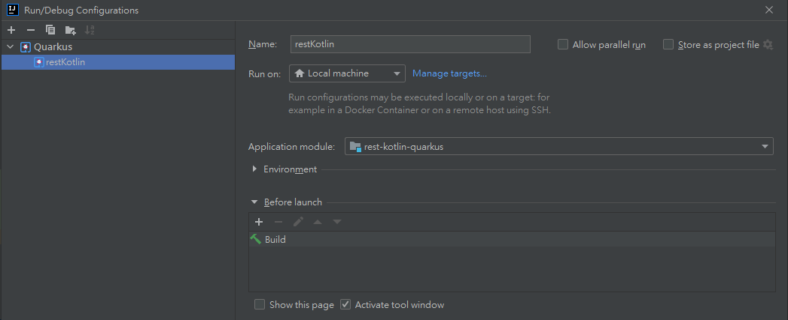
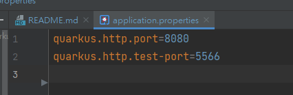
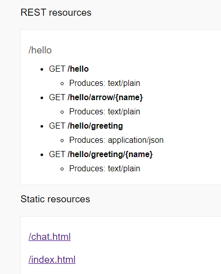
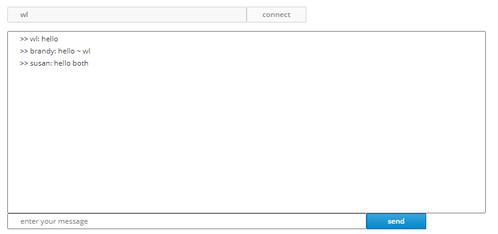
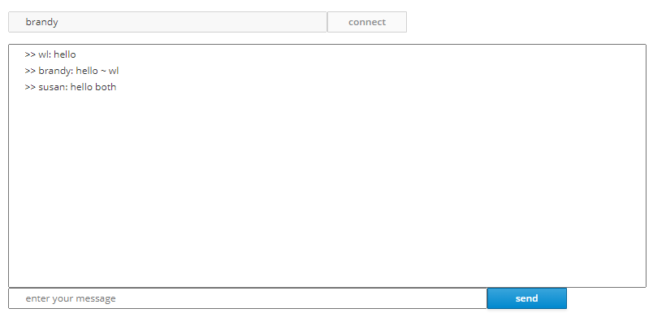
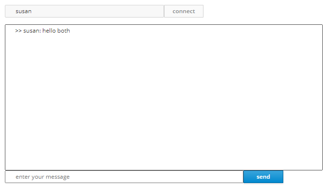

# rest-kotlin-quarkus Project

This evaluation project uses Quarkus, Kotlin, WebSocket and Arrow

If you want to learn more about Quarkus, please visit its website: https://quarkus.io/ .

## Running the application in IntelliJ

## Set http port at **src/resources/application.properties**

  
the service listening on http://localhost:8080

## Resources List

## Chat Room Screenshot

### Reference
* https://code.quarkus.io/
* https://github.com/quarkusio/quarkus-quickstarts
* https://quarkus.io/guides/kotlin
* https://arrow-kt.io/
* https://www.youtube.com/watch?v=i4lCTOgfjMs&t=4061s
* https://www.youtube.com/watch?v=SIr7mcnVy98
